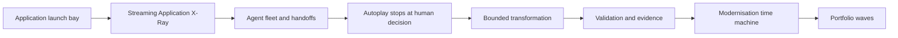
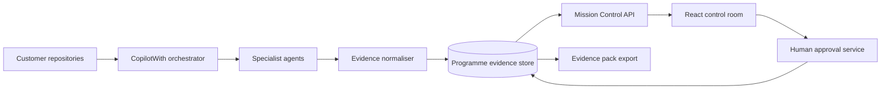

# Architecture

## Current implementation

The accelerator is a client-side React application with a deterministic mission state machine in `src/MissionControl.tsx`. It models application-domain rotation, autonomous scene progression, scan progress, graph focus, specialist selection, agent handoffs, plan constraints, human approvals, transformation output, validation evidence, architecture progression, and portfolio waves.

The current implementation has no backend, authentication, telemetry, or customer repository connection. Its guided replay is deterministic so customer demonstrations do not depend on network or model variance.

## Target modes

- **Story Mode**: curated snapshot with deterministic agent events and proof.
- **Connected Mode**: repository analysis and agent events populate the same UI contract.
- **Workshop Mode**: customer constraints, decisions, comments, and proposed waves are retained as workshop outputs.

## Integration boundaries

1. A versioned programme API returns systems, topology, findings, agent activity, plans, evidence, and gates.
2. An evidence normaliser preserves citations and `OBSERVED`, `INFERRED`, `ASSUMED`, and `SME-CONFIRMED` classifications.
3. Server-Sent Events or WebSockets replay live and recorded agent activity through one event contract.
4. An approval service records identity, scope, conditions, decision, and timestamp.
5. An exporter creates customer-owned decision, audit, and engineering artefacts from the same records.

## Production controls

- Authenticate and authorise per engagement and application.
- Encrypt evidence and isolate customer estates.
- Retain immutable source citations and approval history.
- Redact secrets and personal data before rendering.
- Never infer human approval from agent output.
- Add contract, accessibility, browser, integration, and visual-regression tests.
