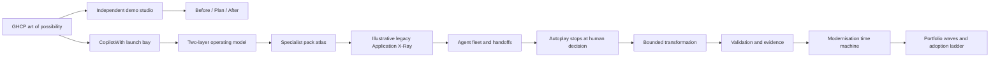
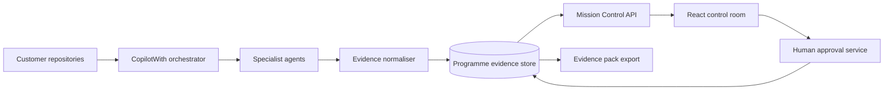

# Architecture

## Current implementation

The accelerator is a client-side React application with a deterministic state machine in `src/MissionControl.tsx`. It has three top-level experiences: a GitHub Copilot possibility opening, the preserved CopilotWith programme journey, and an independently addressable demo studio. The studio owns selected-application and Before / Plan / After state; the programme continues to own pack routing, scan progress, specialist handoffs, approvals, transformation, proof, portfolio waves, and adoption level.

Four named application contexts serve different purposes. `dotnet/eShop` demonstrates modern .NET and Aspire delivery evolution. The Contoso University migration sample demonstrates legacy .NET Framework modernisation. The PetClinic lab demonstrates Java, passwordless PostgreSQL, containerisation, and AKS. Microsoft eShopOnWeb remains the source-grounded deep replay embedded under the eShop journey. These contexts are not blended into one migration claim.

The Demo Studio is deliberately excluded from programme autoplay. The persistent Demos control opens it from any scene and disables autoplay. The embedded eShopOnWeb replay retains its selected Understand, Protect, or Deliver mission state.

The current implementation has no backend, authentication, telemetry, or customer repository connection. Its guided replay is deterministic, and the eShopOnWeb storefront is stored locally, so customer demonstrations do not depend on network or model variance.

## Target modes

- **Story Mode**: curated snapshot with deterministic agent events and proof.
- **Connected Mode**: repository analysis and agent events populate the same UI contract.
- **Workshop Mode**: customer constraints, decisions, comments, and proposed waves are retained as workshop outputs.

## Integration boundaries

1. A versioned programme API returns systems, topology, findings, agent activity, plans, evidence, and gates.
2. An evidence normaliser preserves citations and `OBSERVED`, `INFERRED`, `ASSUMED`, and `SME-CONFIRMED` classifications.
3. Server-Sent Events or WebSockets replay live and recorded agent activity through one event contract.
4. An approval service records identity, scope, conditions, decision, and timestamp.
5. An exporter creates customer-owned decision, audit, and engineering artefacts from the same records.

## Production controls

- Authenticate and authorise per engagement and application.
- Encrypt evidence and isolate customer estates.
- Retain immutable source citations and approval history.
- Redact secrets and personal data before rendering.
- Never infer human approval from agent output.
- Add contract, accessibility, browser, integration, and visual-regression tests.
