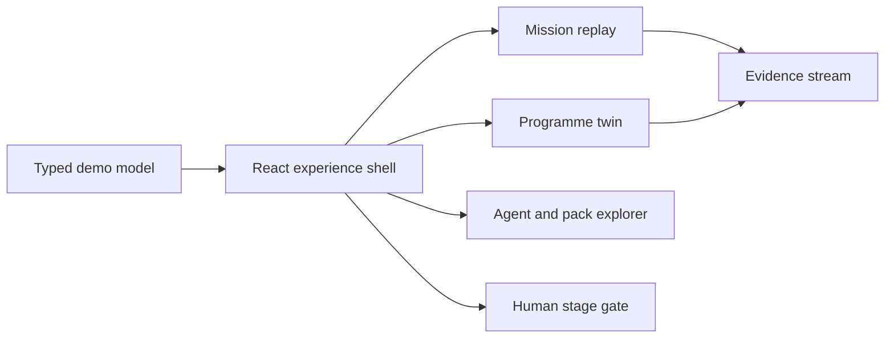
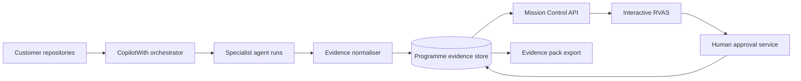

# Architecture

## Current shape

Mission Control is a client-side React application. The UI reads a typed, in-memory programme model and owns only presentation state: selected view, selected agent and node, replay progress, evidence filter, and gate response.

The implementation is deliberately small:

- `src/data.ts` defines agents, evidence events, estate nodes, links, and packs.
- `src/App.tsx` coordinates views and interactions.
- `src/App.css` contains the responsive component system.
- `src/index.css` contains global theme tokens and foundations.

No backend, authentication, telemetry, or customer data connection is included in this MVP.

## Live accelerator target

The next version should retain the typed programme model as a stable UI contract and populate it through adapters.

Recommended integration boundaries:

1. **Programme API** returns estate nodes, relationships, agent activity, evidence, and gates using versioned schemas.
2. **Evidence normaliser** preserves source citations and confidence labels rather than flattening all findings into facts.
3. **Replay service** streams recorded or live agent events through Server-Sent Events or WebSockets.
4. **Approval service** records identity, decision, scope, conditions, and timestamp. The UI must not infer approval from agent output.
5. **Evidence exporter** creates customer-owned decision and audit artefacts from the same underlying records.

## Production controls

- Authenticate users and authorise access per engagement.
- Encrypt evidence in transit and at rest; keep customer estates isolated.
- Store immutable citations and approval history.
- Redact secrets and personal data before evidence reaches the UI.
- Make agent boundaries and confidence classification part of the API contract.
- Add accessibility, browser, integration, and visual-regression tests.